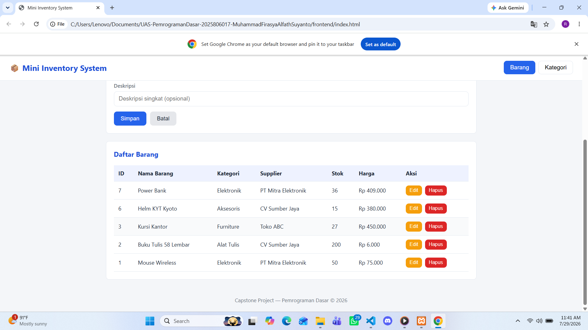
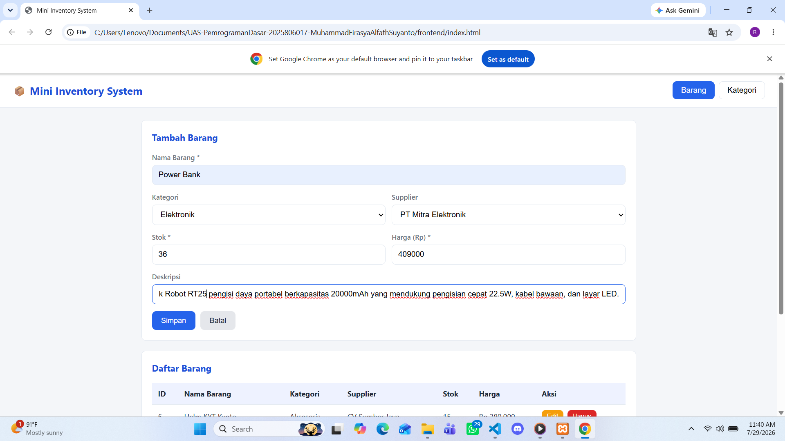
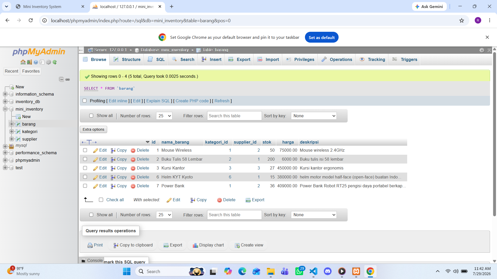

# 📦 Mini Inventory Management System

## Identitas Mahasiswa
| Keterangan | Isi |
|---|---|
| **Nama** | Muhammad Firasya Alfath Suyanto |
| **NIM** | 2025806017 |
| **Kelas** | Teknologi Informasi / 2 Pagi |
| **Mata Kuliah** | Pemrograman Dasar |
| **Tema Proyek** | 🛒 Mini Inventory System |

## Deskripsi Singkat
Aplikasi web sederhana untuk mengelola data **barang, kategori, dan supplier** pada sebuah toko/gudang. Aplikasi mendukung operasi CRUD (Create, Read, Update, Delete) penuh untuk entitas **Barang** dan **Kategori**, dengan data barang yang saling berelasi ke kategori dan supplier.

## 🛠️ Teknologi yang Digunakan
- HTML5, CSS3, JavaScript (Vanilla)
- Node.js + Express.js
- MySQL
- REST API
- Fetch API

## 📁 Struktur Project
```
UAS-PemrogramanDasar-NIM-Nama/
│
├── backend/
│   ├── app.js
│   ├── package.json
│   ├── .env.example
│   ├── config/
│   │   └── db.js
│   ├── controllers/
│   │   ├── barangController.js
│   │   ├── kategoriController.js
│   │   └── supplierController.js
│   ├── models/
│   │   ├── barangModel.js
│   │   ├── kategoriModel.js
│   │   └── supplierModel.js
│   └── routes/
│       ├── barangRoutes.js
│       ├── kategoriRoutes.js
│       └── supplierRoutes.js
│
├── frontend/
│   ├── index.html
│   ├── css/style.css
│   ├── js/script.js
│   └── assets/
│
├── database/
│   └── database.sql
│
├── screenshots/
│   ├── dashboard.png
│   ├── form.png
│   └── database.png
│
├── README.md
├── .gitignore
└── LICENSE
```

## 🚀 Cara Menjalankan Aplikasi

1. **Clone repository**
   ```bash
   git clone https://github.com/Rasya2445/UAS-PemrogramanDasar-2025806017-MuhammadFirasyaAlfathSuyanto.git
   cd UAS-PemrogramanDasar-2025806017-MuhammadFirasyaAlfathSuyanto
   ```

2. **Import database**
   Buka phpMyAdmin (via XAMPP) → buat database baru bernama `mini_inventory` → menu **Import** → pilih file `database/database.sql`.
   Atau lewat terminal:
   ```bash
   mysql -u root -p < database/database.sql
   ```

3. **Konfigurasi environment**
   ```bash
   cd backend
   cp .env.example .env
   ```

4. **Install dependency backend**
   ```bash
   npm install
   ```

5. **Jalankan server**
   ```bash
   npm start
   ```

6. **Buka aplikasi di browser**
   ```
   http://localhost:3000
   ```

## 🔗 Daftar Endpoint REST API

| Method | Endpoint            | Keterangan            |
|--------|----------------------|------------------------|
| GET    | /api/barang            | Ambil semua barang     |
| GET    | /api/barang/:id         | Ambil barang by ID     |
| POST   | /api/barang             | Tambah barang baru     |
| PUT    | /api/barang/:id          | Update barang          |
| DELETE | /api/barang/:id          | Hapus barang           |
| GET    | /api/kategori           | Ambil semua kategori   |
| GET    | /api/kategori/:id        | Ambil kategori by ID   |
| POST   | /api/kategori            | Tambah kategori baru   |
| PUT    | /api/kategori/:id         | Update kategori        |
| DELETE | /api/kategori/:id         | Hapus kategori         |
| GET    | /api/supplier           | Ambil semua supplier   |

## 🗄️ Struktur Database
Tiga tabel saling berelasi:
- **kategori** (id, nama_kategori, deskripsi)
- **supplier** (id, nama_supplier, kontak, alamat)
- **barang** (id, nama_barang, kategori_id → FK, supplier_id → FK, stok, harga, deskripsi)

## 🖼️ Screenshot Aplikasi

**Dashboard / Daftar Barang**


**Form Tambah Barang**


**Struktur Database**


## ✅ Fitur
- CRUD lengkap untuk Barang dan Kategori
- Validasi input di sisi client & server
- Relasi antar tabel (barang → kategori, barang → supplier)
- Tampilan responsif (Flexbox/Grid, hover effect)
- Fetch API dengan async/await
- Struktur backend mengikuti pola MVC (models, controllers, routes)

## 🔗 Link Repository GitHub
`https://github.com/Rasya2445/UAS-PemrogramanDasar-2025806017-MuhammadFirasyaAlfathSuyanto.git`

## 👤 Author
Nama: Muhammad Firasya Alfath Suyanto
NIM: 2025806017
Kelas: Teknologi Informasi 2 Pagi